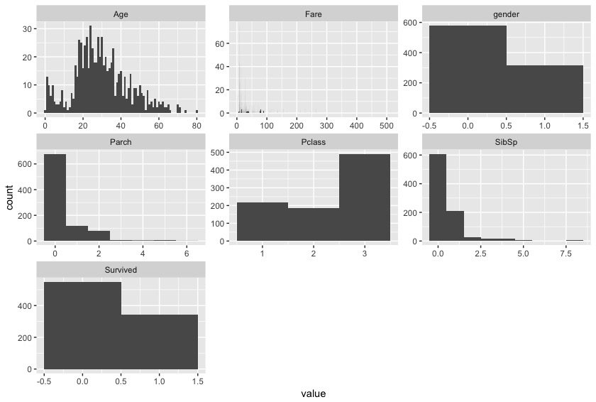
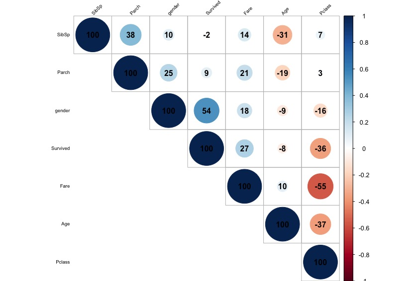

## SurvivalExploration
# This is the first project for Udacity ML nanodegree. The primary goal of this project is to build a model to predict the survival rate of the people on Titanic. 

# Before building the model, I try to use R to create histogram of different variables in the data set.
image: 

# In order to investigate if the variables are correlated with each other, I use R to create a correlation graph.
image: 